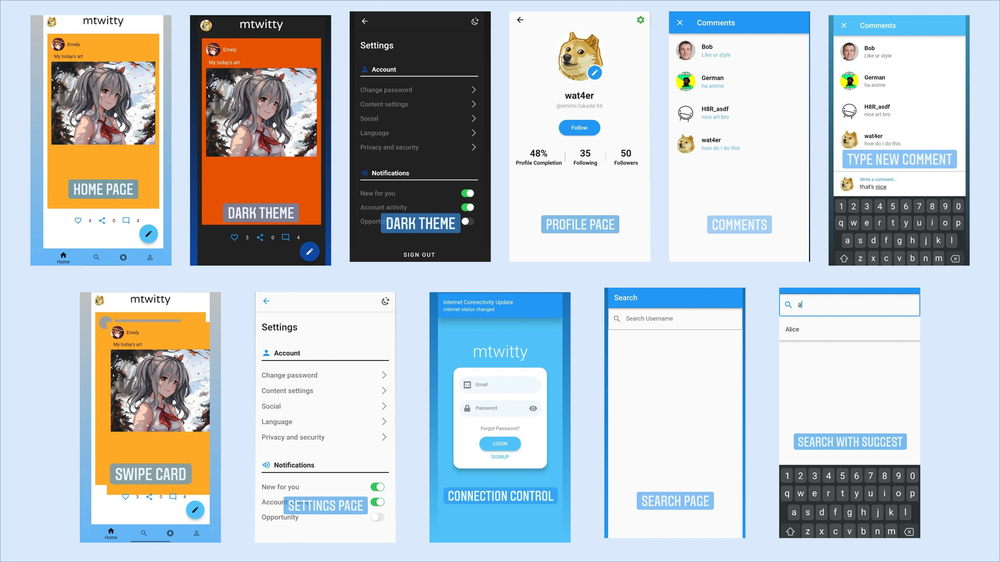
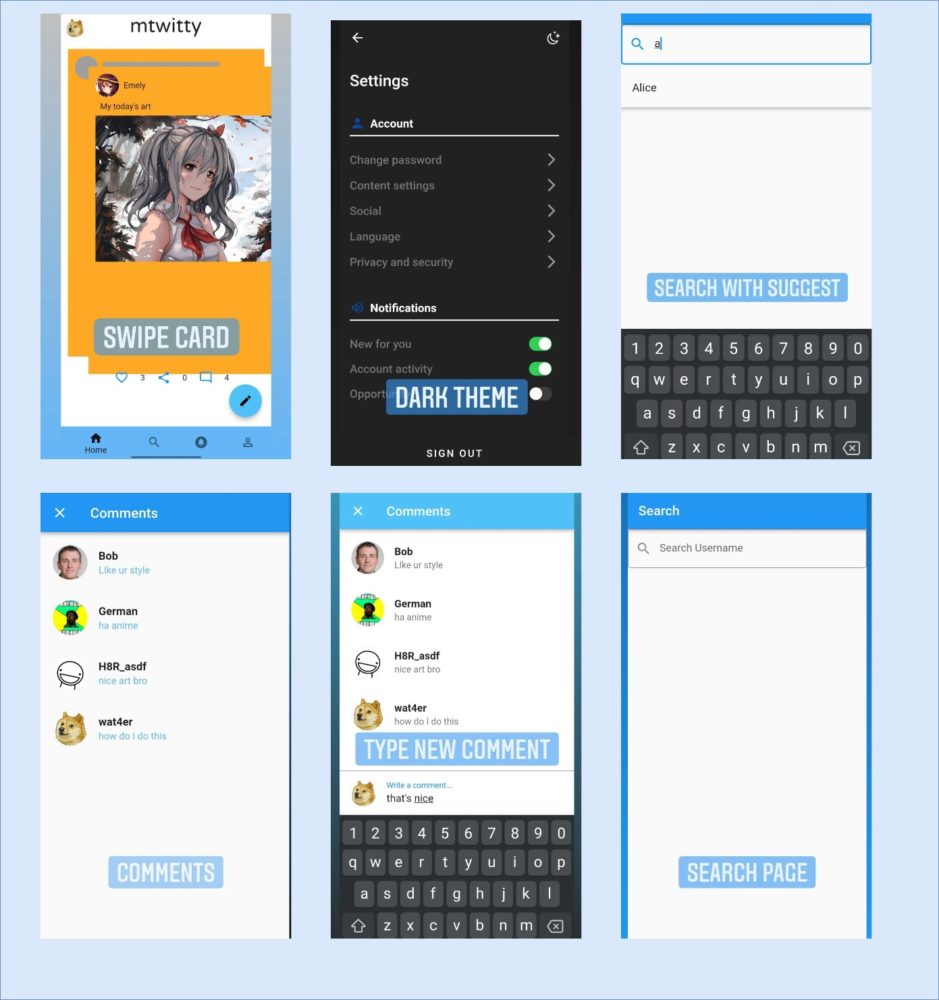

# mtwitt

- Danil Shalagin
- Du Tham Lieu (Thomas)
- Valentin Chernyshov
---------

Link to [apk](./build/app/outputs/flutter-apk/app-release.apk)
Test successful for: Samsung Galaxy A8, Realme x5, Honor 8 lite, and Smart Pixel 4 API 30

## About einstein
mtwitt is a prototype of a minimalist tweeter that offers simplified functionalities so that you can process the tweets one by one.

## How to build
- First download the repository `git clone git@github.com:pierrepicaud/einstein.git`
- Then get the dependencies `flutter pub get`
- Finally build for android `flutter build apk`

## Screens and Features

- Login with Firebase is available
  - email: `test@test.com`
  - password: `asdfgh`
- Click sign-in with mtwitt to skip ()

### Be available soon!
- [ ] GitHub release is created with description of features that are already implemented (+1)